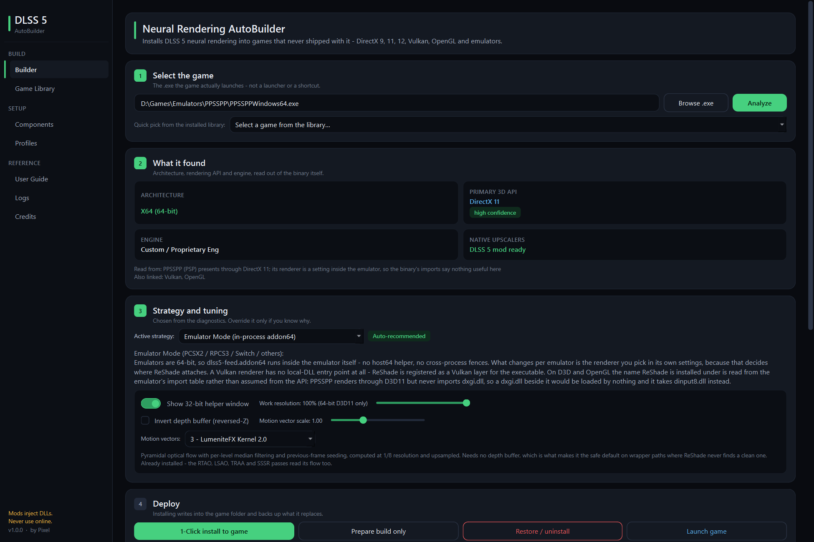

<p align="center">
  
</p>

<h1 align="center">DLSS5-Anywhere</h1>

<p align="center"><em>DLSS 5 neural rendering, in games that never shipped with it.</em></p>

**DLSS5-Anywhere** is a comprehensive Windows automation suite and GUI/CLI tool designed to install, configure, and manage the community **DLSS 5 Neural Rendering mod** across older and non-native games (**DirectX 9, DirectX 11, DirectX 12, Vulkan, OpenGL**, and games without native DLSS).


-0078D6?style=for-the-badge&logo=windows)




> [!CAUTION]
> **Never use this on a game you play online.** Everything this tool installs is a DLL
> injected into the game process, which is indistinguishable from a cheat to
> EasyAntiCheat, BattlEye, Vanguard, VAC, Ricochet and every other anti-cheat. Bans are
> applied to your account by the publisher, are usually permanent, and are not appealable
> on the grounds that the DLL was only a shader injector. The app detects protected titles
> and blocks the install behind an explicit acknowledgement — that warning exists because
> the cost lands on you, not on the tool.

---

## 📖 How to Run DLSS5-Anywhere

You can run DLSS5-Anywhere either using the **Graphical User Interface (GUI)** or via the **Command Line Interface (CLI)**.

### Prerequisites
Make sure you have Python 3.10 or newer installed on Windows, then install dependencies:
```powershell
cd path\to\DLSS5-Anywhere
pip install -r requirements.txt
```

The interface is built on **PySide6 (Qt 6)**, which is the largest of the dependencies
(~250 MB) and the only one the GUI needs; the CLI runs without it.

---

### Option 1: Running the GUI (Recommended)

#### Method A: 1-Click Batch Launcher
Double-click `run_gui.bat` in Windows Explorer.

#### Method B: Terminal Command
```powershell
cd path\to\DLSS5-Anywhere
python main.py
```

#### GUI Step-by-Step Workflow:

The **Builder** tab is four numbered steps, and the chip beside each one fills in when
that step has been satisfied.

1. **Select the game** - click `Browse .exe`, paste a path, or pick a discovered game from
   the *Quick pick* dropdown. The **Game Library** tab lists everything found across Steam,
   Epic and GOG; `Select for Modding` on any row sends it here.
2. **What it found** - architecture, rendering API, engine and native upscalers, read out
   of the binary. The API tile carries a confidence chip and the evidence the detector
   used, because a wrong API is worth arguing with before an install rather than after.
3. **Strategy and tuning** - chosen from the diagnostics, with the motion vector provider,
   work resolution and depth buffer settings alongside it.
4. **Deploy**:
   - **`1-Click install to game`** - injects the mod into the game directory, backing up
     whatever it replaces into `.dlss5_backup/`.
   - **`Prepare build only`** - stages a standalone `DLSS5_Build_<GameName>/` folder with
     an `apply_dlss5.bat`, so the files can be reviewed first.
   - **`Restore / uninstall`** - returns the folder to vanilla and puts the originals back.
   - **`Launch game`** - starts the game with the mod in place.

Installing into a game that ships anti-cheat opens a confirmation that names what was
found and keeps its accept button disabled until the risk has been acknowledged.

#### Adding games the scan cannot find

The scanners read Steam, Epic and GOG manifests, so they find what a launcher installed
and nothing else. Emulators, portable builds and anything unpacked by hand have no
manifest to read, and those are a large part of what this tool is for.

The **Game Library** tab therefore has two ways in, and **both are saved to
`library/custom_games.json` and come back the next time the app opens**:

- **`Add .exe…`** — point at the executable itself. Select several at once to add a whole
  emulator folder in one pass. A name is suggested from the containing folder (so
  `Emulators\RPCS3\bin\rpcs3.exe` is offered as *RPCS3*, not *bin*) and can be edited
  before it is saved, or renamed later by right-clicking the row.
- **`Scan folder…`** — walks one level of subfolders and picks the most likely game
  executable in each. Good for a folder of installed games; no use for a single emulator,
  which is what `Add .exe…` is for.

Manually added rows carry a **Remove** button. Removing one only forgets the entry —
nothing on disk is touched. If the executable behind an entry disappears, the row stays,
marked **MISSING**, rather than being deleted: a game uninstalled or a drive unplugged is
not the app's decision to act on. Entries also show up in the CLI's `scan` output and in
the Builder's *Quick pick* dropdown.

---

### Option 2: Running via Command Line (CLI)

Run via `run_cli.bat` or `python main.py <command>`:

```powershell
# 1. Analyze any game executable (Architecture, API, Engine, Strategy)
python main.py detect "D:\Games\Metro 2033 Redux\metro.exe"

# 2. Stage a standalone build folder without modifying the game
python main.py build "D:\Games\Metro 2033 Redux\metro.exe"

# 3. Direct 1-Click install to game folder with auto-backup
python main.py install "D:\Games\Metro 2033 Redux\metro.exe"

# 4. Restore game directory to vanilla state
python main.py uninstall "D:\Games\Metro 2033 Redux"

# 5. Scan all storage drives for installed Steam, Epic Games, and GOG games
python main.py scan

# 6. Check status of all mod components in local repository
python main.py components

# 7. Download all missing public components
python main.py download-all

# 8. Auto-scan system drives for proprietary user files
python main.py auto-import

# 9. Import a specific user-supplied file
python main.py import-file "D:\Downloads\renodx-dlss5.addon64"
```

---

## 📦 What Actually Gets Installed

DLSS5-Anywhere automates the install described by the
[DLSS5-Feeder](https://github.com/jlrouzies-fr/DLSS5-Feeder#readme) project. Two facts shape
every layout it produces:

* **NGX is 64-bit only.** A 32-bit game cannot host the neural rendering stack in its own
  process at any setting. `dlss5-feed.addon32` runs inside the game and hands the work to
  `host64\dlss5-feed-host64.exe`, and `host64\` is where ReShade x64, `renodx-dlss5.addon64`
  and the nvngx runtimes go. Putting an `.addon64` next to a 32-bit game does nothing at all —
  a 32-bit ReShade only ever loads `.addon32` files, which is why the Add-ons tab stays empty.
* **D3D9 is not a presentation path the feeder supports.** The add-on's own description says
  what it does feed: *"32-bit D3D11, OpenGL and Vulkan (DXVK) games"*. So a D3D9 title has to
  be translated first, and there are two ways to do it:
  * **DXVK** (the default) — `d3d9.dll` → Vulkan, in the game's own process. No watermark, and
    the video memory the engine reads back is a line in `dxvk.conf` instead of an emulated
    video card's claim. ReShade has no local-DLL entry point on Vulkan and is registered as a
    layer for the executable. **The add-on's "Work resolution" control is fixed at 100% on
    this path** — it only exists on the D3D11 transport.
  * **dgVoodoo2** (the fallback) — `D3D9.dll` → D3D11, with ReShade as `dxgi.dll`. Use it for
    D3D8, and for early titles DXVK will not start.

### 64-bit game (D3D11 / D3D12 / Vulkan / OpenGL)

```
<game>.exe
dxgi.dll                     ReShade 6.8+ x64, add-on support  (name varies - see below)
nvngx_dlssnr.dll             neural rendering runtime
nvngx_dlss.dll               super resolution runtime
ReShade.ini                  incl. [RenoDX.DLSS5] - the neural rendering settings
DLSS5_Preset.ini             which effects run, and in what order
dlss5-addons\
    dlss5-feed.addon64       DLSS5-Feeder add-on
    renodx-dlss5.addon64     DLSS 5 neural rendering add-on  (pin to v4.55)
    alexs-toolkit.addon64    optional: the multi-pass DLSS 5 cascade
    alexs-toolkit.cfg        its cascade settings
    dlss5-feed.cfg
    nvngx_dlssnr.dll         hard link to the copy above - see below
    nvngx_dlss.dll           hard link to the copy above
reshade-shaders\Shaders\     DLSS5_Feed.fx, lumenite_*.fx, include\, ReShade.fxh, DrawText.fxh
reshade-shaders\Textures\    lumenite_bluenoise256.png
```

**Why the add-ons sit in a folder of their own.** ReShade loads every `.addon64` in the
directories `AddonPath` names, so an `AddonPath` of `.\` means *load everything next to the
game executable*. A game folder that already holds somebody's add-on pack does not then get
a two-add-on install; it gets a twenty-four-add-on install, and the twenty-two nobody asked
for are the ones that break it — a black screen for the length of a load, two mouse cursors,
several add-ons tone-mapping the same frame, and a DLSS path that reports ready while
another add-on holds the hooks.

The generated `ReShade.ini` therefore says `AddonPath=.\dlss5-addons\`, and ReShade never
enumerates the game folder at all. Nothing of yours is moved, renamed or deleted; setting
`AddonPath=.\` restores the old behaviour.

> ReShade's own `DisabledAddons` key cannot do this. It matches on the name an add-on
> *registers at runtime* — `ReShade64-AdjustDepth-By-seri14.addon64` registers as
> `"Adjust Depth"` — which no installer reading files on disk can know before the add-on has
> loaded. It also still lists disabled add-ons in the Add-ons tab.

The two nvngx runtimes exist in both places because two different pieces of code look in two
different places, and both are right: `renodx-dlss5` resolves `nvngx_dlssnr.dll` against its
own module directory, while NGX looks for `nvngx_dlss.dll` next to the executable. They are
165 MB and 59 MB, so the second name is a **hard link** — one file, no extra bytes.

### 32-bit game (adds the helper process)

```
<game>.exe
dxgi.dll                     ReShade 6.8+ x86
dlss5-addons\
    dlss5-feed.addon32       DLSS5-Feeder add-on (x86)
ReShade.ini, DLSS5_Preset.ini, reshade-shaders\  (same as above)
host64\
    dlss5-feed-host64.exe    64-bit helper - opens a "32-bit DLSS 5 Feeder" window
    dxgi.dll                 ReShade x64
    ReShade.ini              [RenoDX.DLSS5] lives HERE, not in the game folder
    renodx-dlss5.addon64     DLSS 5 neural rendering add-on  (pin to v4.55)
    nvngx_dlssnr.dll
    nvngx_dlss.dll
    alexs-toolkit.addon64 / .cfg    optional, next to the add-on it extends
```

The neural add-on keeps its settings in ReShade's own config rather than a file of its
own, so they land in the `ReShade.ini` sitting in the add-on's folder - `host64\ReShade.ini`
here. A `[RenoDX.DLSS5]` section in the game folder's `ReShade.ini` would be read by
nothing.

### DirectX 9 game (either bitness)

Everything above, plus the translation layer next to the executable.

**DXVK (default):**

```
d3d9.dll                     DXVK, matching the game's architecture
dxvk.conf                    d3d9.maxAvailableMemory = 4096
(no dxgi.dll)                ReShade is registered as a Vulkan layer instead
```

DXVK leaves no watermark, so confirm it loaded another way: `set DXVK_HUD=version` for one
launch puts the build number in the corner, and `DXVK_LOG_LEVEL=info` writes it to a log. If
neither appears the game is still on the system `d3d9.dll`.

> [!WARNING]
> **DXVK reads `$PWD/dxvk.conf` — the working directory, not the folder the `.exe` is in.**
> Launch the game any way that does not set the working directory to the game folder and the
> generated file is silently not read. `launch_with_dlss5.bat` sets `DXVK_CONFIG_FILE` to its
> full path, which removes the question.

> [!WARNING]
> **The DLSS 5 add-on's "Work resolution" control does not exist on this path.** The add-on
> offers it on its D3D11 transport and pins it at 100% on OpenGL and Vulkan — *"DLSS runs at
> the game's native resolution there"*. If you render below native for frames, that is the
> reason to stay on dgVoodoo2; a profile with work resolution under 100% is built that way
> automatically.

**dgVoodoo2 (fallback — D3D8, and games DXVK won't start):**

```
D3D9.dll                     dgVoodoo2 wrapper, matching the game's architecture
dgVoodoo.conf                DisableAndPassThru=false, VRAM=1024, VideoCard=internal3D
dgVoodooCpl.exe
```

The generated `dgVoodoo.conf` leaves `dgVoodooWatermark = true` on purpose. **If the watermark
does not appear, dgVoodoo is not running and nothing downstream can work** — that is the check
to make before blaming anything else. It now clears itself after 15 seconds
(`WatermarkDisplayDuration`, which ships as `0` meaning *for ever*); set `dgvoodoo_watermark`
to `false` in the profile to stop it appearing at all.

> [!NOTE]
> **Old engines size their graphics presets from the video memory the device reports** — and
> behind either layer, that is not the card's own figure. It is `VRAM` in `dgVoodoo.conf`, or
> `d3d9.maxAvailableMemory` in `dxvk.conf`. A RAGE game (GTA IV) additionally clamps its
> settings when it does not recognise the device, which is what the generated
> `commandline.txt` containing `-norestrictions` lifts. `-availablevidmem` is deliberately
> never written: it changes the streamer's memory budget, and a wrong value hangs the game on
> its loading screen while the renderer keeps presenting frames.

---

## 🧩 Required Components

| Piece | Source | Fetched automatically |
| :--- | :--- | :---: |
| ReShade 6.8+ with add-on support (x86 **and** x64) | reshade.me installer, run headless for each architecture | ✅ |
| `dlss5-feed.addon64` / `.addon32` / `dlss5-feed-host64.exe` / `DLSS5_Feed.fx` | [DLSS5-Feeder releases](https://github.com/jlrouzies-fr/DLSS5-Feeder/releases/latest) | ✅ |
| LumeniteFX — the whole suite: `lumenite_Kernel.fx` (motion vectors) plus RTAO, SSSR, the AO variants and the bloom, `include\`, blue noise texture | [LumeniteFX](https://github.com/umar-afzaal/LumeniteFX) (`mainline` branch) | ✅ |
| vort_Shaders — `vort_Motion.fx` + `Includes\`, blue noise texture. **Optional**: the alternative motion vector provider | [vort_Shaders](https://github.com/vortigern11/vort_Shaders) (`main` branch) | ✅ |
| `ReShade.fxh`, `DrawText.fxh` | [crosire/reshade-shaders](https://github.com/crosire/reshade-shaders) | ✅ |
| DXVK (D3D9 → Vulkan) — only `d3d9.dll` is used | [DXVK releases](https://github.com/doitsujin/dxvk/releases) | ✅ |
| dgVoodoo2 (D3D9/8 → D3D11) | [dgVoodoo2 releases](https://github.com/dege-diosg/dgVoodoo2/releases) | ✅ |
| `renodx-dlss5.addon64` **v4.55** | RenoDX Discord, `#DLSS5` channel | ❌ user-supplied |
| `nvngx_dlssnr.dll` | same channel | ❌ user-supplied |
| `nvngx_dlss.dll` | any DLSS game, or [DLSS Swapper](https://github.com/beeradmoore/dlss-swapper) | ❌ user-supplied |
| `alexs-toolkit.addon64` - **optional**, runs the neural pass 2x or 3x | same channel | ❌ user-supplied |
| `deep-fried-chicken.addon64` + `-nvngx.dll` + `.cfg` — **optional**, the alternative neural consumer | its own official release; the author asks that the link be shared rather than the archive rehosted | ❌ user-supplied |

> [!IMPORTANT]
> **Pin `renodx-dlss5.addon64` to v4.55.** Builds past it construct part of the synthetic DLSS
> contract themselves and conflict with DLSS5-Feeder.

Import all three of Chicken's files, its `.cfg` included — that file is 346 lines across thirty
layer blocks, and this tool patches the handful of keys it owns rather than writing one from
scratch. See [Choosing the neural consumer](#-choosing-the-neural-consumer) for which of the
two to pick, and for the one case where Chicken cannot run at all.

The user-supplied files are 64-bit only. For a 32-bit game the tool installs them into
`host64\`; it will refuse an import that is not a 64-bit PE, and it ignores any
`renodx-dlss5.addon32` — no such build exists.

---

## 🌟 Key Features

1. **Automatic game & API detection** — PE architecture and import table (`pefile` with a
   pure-Python fallback), rendering API, engine heuristics, native upscaler detection, and
   anti-cheat markers with safety warnings. Flags a launcher executable that imports no
   graphics API, so you analyse the process ReShade will actually load into.

2. **Architecture-correct component management** — every binary is verified against its PE
   machine type before it is staged. A 32-bit ReShade cannot end up installed as the 64-bit
   runtime, and a 64-bit add-on cannot end up next to a 32-bit game; both failures are
   otherwise completely silent at runtime.

3. **The look is configured, not left to the user** — the generated `ReShade.ini` carries a
   `[RenoDX.DLSS5]` section that switches neural rendering on and sets its style and
   strengths, the generated `DLSS5_Preset.ini` enables the profile's LumeniteFX effects
   *after* the feed so they land on the neural output, and `alexs-toolkit.cfg` sets the
   multi-pass cascade. On a 32-bit game the neural settings go to `host64\ReShade.ini`,
   which is the only ReShade the add-on there reads.

4. **Strategy engine**
   - **Feeder Mode (DX11/12, Vulkan, OpenGL, 64-bit)** — add-on in process.
   - **32-bit path** — `.addon32` in the game, full stack in `host64\`.
   - **DXVK + Feeder (DX9)** — `d3d9.dll` → Vulkan in-process, ReShade as a Vulkan layer.
   - **dgVoodoo2 + Feeder (DX9/DX8)** — wrapper first, then the layout for that bitness.
   - **Direct / Streamline path** — for games that already have DLSS.
   - **FSR / XeSS bridge (OptiScaler)** — for games exposing FSR2/3 or XeSS.

5. **Multi-store library scanner** — Steam (`libraryfolders.vdf` across drives), Epic
   (`*.item`), and GOG Galaxy registry entries, plus any folder you point it at. Anything the
   scanner misses — emulators, portable builds, launchers with unusual names — can be added by
   picking the `.exe` yourself, and that list persists across restarts. Star the games you
   return to and the **★ Favourites** filter keeps them one click away.

6. **It does not switch on other people's add-ons** — the add-ons go in `dlss5-addons\` and
   ReShade is pointed at that folder alone, so a game folder that already holds an add-on pack
   keeps it dormant instead of having it started by this install. Nothing is moved or deleted.

7. **It refuses rather than half-installing** — every file the install would replace is tested
   for writability before the first byte is written, so installing over a running game stops
   with the names that are in use instead of failing partway through with some files copied and
   no configuration written.

---

## 🔌 What ReShade is installed *as*

ReShade gets into a process by being named after a DLL that process loads, and then
forwarding the real exports on. Which name works is a property of the executable, not of the
rendering API — and the two come apart more often than you would expect.

PPSSPP is the case that proves it. It renders through Direct3D 11, so the obvious choice is
`dxgi.dll` — but PPSSPP never imports `dxgi.dll`. It loads `d3d11.dll` at runtime, and DXGI
arrives as a dependency of the System32 copy, resolved against System32. A `dxgi.dll` sitting
next to the executable is opened by nobody. The install is complete, correct and inert, and
there is no `ReShade.log` to say so because ReShade never ran.

So the installer reads the executable's import table and keeps the API's choice only when the
executable actually imports it. Otherwise it substitutes a name the executable does import,
and says which and why:

| executable | imports `dxgi.dll`? | installed as |
| :--- | :--- | :--- |
| a normal D3D11/D3D12 game | yes | `dxgi.dll` |
| `PPSSPPWindows64.exe` | no | `dinput8.dll` |
| an OpenGL title | no | `opengl32.dll` |
| a Vulkan title / DXVK | — | no local DLL; registered as a Vulkan layer |

`dinput8.dll` is preferred among the fallbacks because it is a *static* import — the loader
resolves it from the application directory at process start, before any of the program's own
code runs — and because it is not a graphics API, so standing in for it cannot pull ReShade
onto a renderer the game is not using. An executable whose import table cannot be read gets no
substitution: a guess from no evidence is worse than the API default.

---

## 🕹️ Emulators

Emulators are supported as first-class targets (PCSX2, RPCS3, PPSSPP, shadPS4, Xenia, and
others), including EmuDeck's builds. Two things about them differ from a normal game.

**The renderer is a setting, not a property of the binary.** An emulator links every backend
it was built with and chooses one at runtime, so its import table says nothing useful. The
tool reads the emulator's own configuration file to find out what it is *actually* set to, and
says so when that does not match what the install attaches through:

> PPSSPP (PSP) is currently set to Vulkan, and this install attaches through Direct3D 11.
> Nothing will load until the renderer is changed to Direct3D 11 in the emulator's graphics
> settings — there is no error when this is wrong, the mod simply never starts.

**This tool never writes to an emulator's settings.** They belong to whoever set the emulator
up. It installs DLSS 5 and reports a mismatch; changing the renderer, the internal resolution
or the deinterlacer is yours to do.

> [!NOTE]
> Direct3D 12 is the cheapest renderer to attach to, and the one recommended below for the
> emulators that offer it — but **not** if you are using Deep Fried Chicken as the neural
> consumer, which cannot run on it at all. Choose Vulkan for those builds; see
> [Choosing the neural consumer](#-choosing-the-neural-consumer).

**Every LumeniteFX pass in the defaults carries a history**, and all of them reproject it
with the same texture:

```hlsl
float2 flow = tex2D(Kernel::sFlow, input.uv).xy;
float2 rawHistory = tex2D(sPrevAO, input.uv + flow).rg;
ao = lerp(ao, prevAO, alpha);          // RTAO: alpha up to confidence * 0.98
```

When that flow is zero, `input.uv + flow` is `input.uv`, and each pass blends the previous
frame onto this one without reprojecting it. `Lumenite_TRAA` holds 0.9 of its history and the
two AO passes up to 0.98. That is what a second, ghosted copy of the image looks like — and
DLSS is accumulating on the same vectors, so it suffers too.

**Whether that happens is a property of the flow field, not of the emulator.** Measured on one
machine, on identical defaults:

| | motion vectors | depth | result |
| :--- | :--- | :--- | :--- |
| RPCS3 | **99–100% non-zero** | flat at 1.0 | excellent |
| PPSSPP | **0% non-zero** | flat at 0.89 | ghosting |
| PCSX2 | 98% non-zero | flat at 0 | ghosting from the emulator's own deinterlacer |

Note the depth column: RPCS3's depth buffer is as unusable as the other two and it still looks
excellent. **The motion vectors are what decide it**, not depth.

Nothing can know which case a game is before it runs, so the defaults are the same everywhere
and the log answers it afterwards. **Read `dlss5-addons\dlss5-feed.log`:**

```
[feed] MV probe (centre 64x64, frame 600): mean |mv| 20.085 px, max 30.35 px, 69% non-zero
[feed] MV probe (centre 64x64, frame 600): mean |mv| 0.000 px, max 0.00 px, 0% non-zero
                                            ^ DLSS is getting (almost) no motion vectors
```

Whole pixels while the camera moves is healthy. If it reads `0%`, untick `Lumenite_RTAO`,
`Lumenite_LSAO` and `Lumenite_TRAA` in ReShade's Home tab — they cannot do anything useful
without vectors and each one is a ghost generator. And do not add the multi-pass cascade there:
multiplying a history that cannot be reprojected only multiplies the ghosting.

> A ghosted image in an emulator is often not this mod at all. PS2 games are interlaced, and
> PCSX2's **Automatic** deinterlacer commonly resolves to a *Blend* mode that averages two
> fields into one frame — a dual image by construction, present with nothing installed.

---

## 🔍 How the rendering API is detected

The API decides where ReShade attaches, so getting it wrong wastes an entire install. The
detector weighs several kinds of evidence rather than trusting any single one, and reports
what it read along with how sure it is:

| Evidence | Weight | Why |
| :--- | :--- | :--- |
| Import table (`d3d12.dll`, `vulkan-1.dll`, …) | 100 | The game links it; no ambiguity |
| Delay-load import table | 90 | Still a hard link, resolved on first use |
| D3D12 Agility SDK (`D3D12Core.dll`) | 100 | Useless without a D3D12 renderer, so shipping one proves there is one |
| Engine config (`DefaultGraphicsRHI=DX12`) | 80 | Unreal states outright which RHI it starts in |
| API entry points in the binary (`D3D12CreateDevice`) | 55 | The `LoadLibrary` path, which imports never show |
| DLL name as a string | 45 | Weaker — could be a log line |
| A plausible sibling DLL | 30 | Only when it is not a known wrapper |
| The engine's usual default | 15 | Tie-breaks only |

Three things this fixes over a naive import scan:

- **Wrappers are not the game's renderer.** A `d3d9.dll`, `dxgi.dll` or `opengl32.dll`
  sitting in a game folder is almost always ReShade, DXVK, dgVoodoo2, OptiScaler or an
  overlay — they take a system DLL's name so the loader finds them first. These are now
  identified by content and reported separately instead of being counted as the API.
- **Dynamically loaded renderers are found.** Modern engines link only `dxgi.dll` and
  reach D3D12 through `LoadLibrary`. The binary is scanned for entry points as ASCII *and*
  UTF-16, since `LoadLibraryW` takes a wide string.
- **Emulators are asked, not guessed.** shadPS4, RPCS3, PCSX2 and the rest link every
  backend they were built with — shadPS4 carries D3D9, D3D11, D3D12 and OpenGL strings
  while presenting only through Vulkan. The emulator profile decides, not the binary.

Confidence is reported as **high / medium / low** on the Builder tab, with the evidence
underneath it. Low confidence means the detector found something but could not separate
two candidates — check it before installing.

---

## 🌀 Choosing a motion vector provider

DLSS reconstructs a frame by asking where every pixel was in the last one. A game that
shipped with DLSS answers from its own renderer; a game that did not never answers at all, so
the vectors have to be estimated from the frame itself by a ReShade effect. `DLSS5_Feed.fx`
then re-declares that effect's output texture exactly as the effect declares it, which is how
ReShade binds them to the same resource.

That makes the provider one choice with three halves that must agree — a preprocessor number,
an enabled technique above `DLSS5_Feed`, and a staged `.fx` file. The Builder tab's **Motion
vectors** picker and the profile editor set all three together; nothing here needs editing by
hand.

| | LumeniteFX Kernel 2.0 *(default)* | vort_MotionEffects |
| :--- | :--- | :--- |
| `DLSS5_MV_PROVIDER` | `3` | `2` |
| Technique | `Lumenite_Kernel` | `vort_MotionEffects` |
| Resolution | 1/8, upsampled | full |
| Depth buffer | not needed | not needed |
| Cost | lower | higher |

**Start with the default.** Kernel needs no depth buffer, which is what makes it safe on the
wrapper paths where ReShade never finds a clean one, and the RTAO, LSAO, SSSR and TRAA passes
read its flow anyway. Reach for **vort** when fine detail smears or thin geometry ghosts —
full-resolution flow resolves what a 1/8-resolution estimate cannot.

> [!NOTE]
> `vort_Motion.fx` also contains a motion blur and a TAA pass. Both would be applied to the
> frame *before* DLSS ran on it, so the generated preset pins `V_ENABLE_MOT_BLUR=0` and
> `V_ENABLE_TAA=0` rather than trusting the defaults.

Picking vort does not switch LumeniteFX off. Its Kernel effect still runs and is still enabled
above the visible effects, because RTAO, LSAO, SSSR and TRAA sample `Kernel::tFlow` directly —
the provider choice only decides what **DLSS** reconstructs from.

---

## 🍗 Choosing the neural consumer

The feeder does not run DLSS Neural Rendering itself. It builds the DLAA contract — colour,
depth, motion vectors — and a second add-on, the **neural consumer**, intercepts the DLSS call
and runs the neural passes on it. Two are supported, and the Builder tab's **Neural pass**
picker chooses between them per game.

They cannot share a process. Both claim the same NGX feature-1 entry points, and Deep Fried
Chicken's own documentation for that situation is *one or the other, never both* — so this is
a single choice, not two switches. Selecting Chicken removes RenoDX from the folder, and Alex's
Toolkit with it: the Toolkit cascades on top of RenoDX, and Chicken runs its own layer stack
instead. Both are user-supplied and imported on the **Components** tab; neither is
redistributed here.

| | RenoDX + Alex's Toolkit *(default)* | Deep Fried Chicken |
| :--- | :--- | :--- |
| Files | `renodx-dlss5.addon64`, `alexs-toolkit.addon64` | `deep-fried-chicken.addon64`, `-nvngx.dll`, `.cfg` |
| Passes | 1–3, from the Toolkit cascade | 1–30, set by `dfc_layers` |
| Settings live in | `[RenoDX.DLSS5]` in `ReShade.ini` | its own `deep-fried-chicken.cfg` |
| Its own log | — | `deep-fried-chicken.log`, beside the `.addon64` |
| **Direct3D 12** | yes — the cheapest path | **no, see below** |
| Vulkan / OpenGL / D3D11 | yes | yes |
| 32-bit games | yes | yes, with the helper window shown |

### Deep Fried Chicken does not work on Direct3D 12

The feeder carries four transports, and three of them do the neural work on a D3D12 device it
created for itself. The fourth, **same-device D3D12**, hands DLSS the *game's* own device and
copies nothing — which is why it is the cheapest, and why an emulator's Direct3D 12 renderer is
recommended everywhere else in this README. Chicken 1.4.8-alpha cannot use that one:

```
standalone FP16 codec allocation failed: game-output device identity failed (0x80070057)
standalone neural path disabled at FP16 codec acquisition
```

…and not one neural frame for the rest of the session. Measured across four installs on one
machine, same add-on build:

| Target | Transport | Result |
| :--- | :--- | :--- |
| RPCS3, PCSX2 *(Vulkan renderer)* | Vulkan | codec cached → frames |
| a Direct3D 11 game | D3D11 → D3D12 | codec cached → frames |
| a 32-bit game *(Prince of Persia)* | host64 helper | codec cached → 4,800 frames |
| a Direct3D 12 game *(Resident Evil 4)* | **same-device D3D12** | **neural path disabled** |

> [!WARNING]
> This failure looks exactly like a working install. ReShade registers the add-on, its panel
> and per-pass tabs work, the pass count can be changed, and `dlss5-feed.log` reports the
> consumer `ARMED` and goes on delivering DLAA frames for as long as you play.
> `deep-fried-chicken.log` is the only file that says otherwise.

So for a Direct3D 12 game, **use RenoDX** — or build for the game's DirectX 11 mode if it has
one. For an emulator, set its renderer to **Vulkan** rather than Direct3D 12 and install again.
The Builder tab says this the moment Chicken is picked for such a game, and the build plan
repeats it; neither is a silent substitution, because which consumer runs is your choice.

### On a 32-bit game, Chicken lives in the helper window

NGX is 64-bit only, so a 32-bit game runs the consumer in `host64\` — and Chicken's panel is a
ReShade tab in *that* process. The feeder mirrors a consumer's settings onto the game's own
overlay page, but it mirrors RenoDX's `[RenoDX.DLSS5]` keys, so Chicken's tabs exist nowhere
else. A build that selects it therefore writes `host_window=1` into `dlss5-feed.cfg` and shows
the helper window; press **Home** in that window, not in the game. Its log is
`dlss5-addons\host64\deep-fried-chicken.log`.

---

## 🎮 In-Game Setup

1. Press **`[Home]`** for the ReShade overlay.
2. **Home tab**: the profile's techniques are already ticked, in order — `LUMENITE: Kernel
   2.0` (the motion vector provider, which must run before the feed reads it), `DLSS 5
   Feed`, then whatever the profile enables on top. Anything below `DLSS 5 Feed` is applied
   to the neural output, which is where AO, reflections and bloom belong.
3. **Add-ons tab**: **`DLSS 5 Neural Rendering`** should already be **on** — the install
   writes it into `[RenoDX.DLSS5]`. If it is off, that section did not reach the add-on:
   check it is in the `ReShade.ini` in the *add-on's own* folder (`host64\` for a 32-bit
   game).
4. Turn the game's own **MSAA/SSAA off**.
5. **`[F2]`** toggles the effects for A/B comparison.

> [!TIP]
> **"It installed fine and it looks like almost nothing."** With neural rendering off and
> no effects enabled, a completely healthy install is a DLAA pass and nothing else: cleaner
> edges, no new lighting, no reflections, no recovered detail. That is the whole difference
> between a working install and an impressive one — the pipeline underneath is identical.
> What separates them: the `[RenoDX.DLSS5]` switch, the effects enabled in
> `DLSS5_Preset.ini`, and whether the multi-pass cascade is present.

On a 32-bit game the first fed frame spawns `host64\dlss5-feed-host64.exe`, which opens a
window titled **"32-bit DLSS 5 Feeder"**. The DLSS 5 add-on's own full panel lives in that
window — the game's overlay only shows the feeder's page.

### Confirming it is really running

`dlss5-addons\dlss5-feed.log` (the feeder writes it beside its own module) should contain:

- `feature ready … DLAA`
- `frame N delivered`
- `DLSS5_MV_PROVIDER=3 (LumeniteFX Kernel) -> Lumenite_Kernel (enabled)` — or `=2` and
  `vort_MotionEffects`, if that is the provider you picked

The overlay's **Motion vectors** section reports the same, in red when the shader was compiled
for one provider while a different one is enabled. An MV probe logs the share of non-zero
vectors every 600 frames — while you move, that must not be 0%.

---

## 🔧 Troubleshooting

| Symptom | Cause | Fix |
| :--- | :--- | :--- |
| **Add-ons tab shows nothing** | Either ReShade never attached, or the add-on is the wrong bitness — a 32-bit ReShade loads only `.addon32`, a 64-bit one only `.addon64`. | First check a `ReShade.log` exists in the game folder: if it does not, ReShade was never loaded and the proxy DLL has a name this executable does not import. If it does, use the layout for the game's actual architecture; for a 32-bit game the 64-bit add-ons belong in `host64\`. |
| **Overlay opens but the Add-ons tab is empty** | A machine-wide ReShade (`C:\ProgramData\ReShade`) attached instead of this install. It registers as an implicit Vulkan layer, so it loads into anything that initialises Vulkan — including an emulator that only probes for it — and it writes its own `ReShade.log` over this one's. | The install's own ReShade lists exactly two add-ons. If yours lists none, that is the other copy; uninstall it or use its own configuration. |
| **A second, ghosted copy of the image** | Something temporal is accumulating without usable motion vectors. | Check the motion-vector probe in `dlss5-addons\dlss5-feed.log`: `0.000 px, 0% non-zero` means ReShade is not finding a real depth buffer, so nothing can reproject. Fix depth in ReShade's **Depth** tab first; on emulators also check the emulator's own deinterlacing and internal-resolution settings, which produce this on their own with no mod installed. |
| **Effects list is empty / "failed to compile"** | `ReShade.fxh` or `DrawText.fxh` missing from `reshade-shaders\Shaders`, or `EffectSearchPaths` does not point there. | Download the *ReShade Base Shader Includes* component. `ReShade.log` names the failing include. |
| **No overlay at all** | ReShade DLL is the wrong architecture for the process, or (D3D9) dgVoodoo is not running. | Check the dgVoodoo watermark first, then that `dxgi.dll` matches the game's bitness. |
| **dgVoodoo appears to do nothing** | `DisableAndPassThru = true` — the shipped default. | Set it to `false`; keep the watermark on until it appears. |
| **Watermark never goes away** | `WatermarkDisplayDuration = 0` — dgVoodoo's default means *for ever*. | The generated conf sets 15 seconds; `dgvoodoo_watermark: false` in the profile removes it entirely. |
| **Game reports a few hundred MB of video memory (DXVK)** | DXVK computes `min(deviceMemory + systemMemory, d3d9.maxAvailableMemory) - 8MB`, and its **built-in profile pins `dxgi.maxDeviceMemory` to 128 MB for `GTAIV.exe`/`EFLC.exe` on purpose**. `d3d9.maxAvailableMemory` is only a ceiling — it can lower that figure, never raise it. | Set `dxvk_max_device_memory_mb` in the profile (writes `dxgi.maxDeviceMemory`), and keep `dxvk_max_available_memory_mb` at least as high. You are switching off a deliberate workaround, so put it back if textures misbehave. |
| **Game reports a few hundred MB of video memory (dgVoodoo2)** | The engine reads back the wrapper's configured VRAM on an emulated card. | Raise `VRAM` in `dgVoodoo.conf`. |
| **Settings sliders greyed out / stuck on low (GTA IV)** | The RAGE engine clamps its presets when it does not recognise the device. | Keep the generated `commandline.txt` with `-norestrictions`. |
| **"Work resolution" greyed out in the overlay** | The install is on the OpenGL or Vulkan transport, where the add-on fixes it at 100%. | Use the dgVoodoo2 strategy (D3D11). Setting work resolution below 100% in a profile now picks that path for you. |
| **No overlay under DXVK** | ReShade was not registered as a Vulkan layer — there is no DLL to copy on this path. | Run `ReShade_Setup_Addon.exe`, point it at the game .exe, choose Vulkan. |
| **"Ran out of video memory"** | dgVoodoo's stock `VRAM = 256`. | Use `1024`. Avoid `2GB` — some old engines mishandle it. |
| **MV probe reads 0% non-zero** | No motion vector provider enabled, or a provider that does not compile. | Enable `LUMENITE: Kernel 2.0` above the feed. Do **not** use DRME — it does not compile on ReShade 6.8. |
| **Halo around characters / inverted sky** | Reversed-Z depth buffer | Overlay → global preprocessor definitions → `RESHADE_DEPTH_INPUT_IS_REVERSED` 0 ⇄ 1, then Reload. |
| **Upside-down flow** | Flipped Y axis | `RESHADE_DEPTH_INPUT_IS_UPSIDE_DOWN=1`. |
| **Crash on startup** | Conflicting overlays | Disable RivaTuner / MSI Afterburner / Discord overlay, or run `uninstall_dlss5.bat`. |
| **Artifacts with Smooth Motion or OptiScaler** | Both are incompatible with the feeder. | Turn them off. |
| **Everything works, the image barely changes** | Neural rendering off and/or no effects enabled — a DLAA-only install. | Add-ons tab → `DLSS 5 Neural Rendering` on; Home tab → tick the profile's effects. Check `[RenoDX.DLSS5]` is in the `ReShade.ini` ReShade actually loaded — the game folder's for a 64-bit game, `host64\ReShade.ini` for a 32-bit one. |
| **Neural rendering looks thin next to other people's** | DLSS 5 is running a single pass. | `alexs-toolkit.addon64` next to the neural add-on in `dlss5-addons\`, with `alexs-toolkit.cfg` set to `two_pass=1`. `dlss5-feed.log` reports which cascade it found. |

---

## 👥 Credits & Acknowledgments

This tool orchestrates an incredible ecosystem of open-source modding technologies, graphics wrappers, and community research. Huge credit and gratitude belong to the developers and communities who created the underlying tools and shaders.

The same list ships inside the app, under **Credits** in the navigation rail — attribution
should not live only in a file people read once. It is defined in one place
(`dlss5_anywhere/config.py`, `CREDITS`) so the app and this README cannot drift apart.

DLSS5-Anywhere automates installation and generates configuration. **It renders nothing
itself.** Every effect you see on screen is the work of the projects below:

* **[crosire](https://github.com/crosire) & the [ReShade Team](https://reshade.me)**:
  For developing **ReShade** and the **ReShade Add-on Framework**, which makes runtime injection, depth buffer access, and add-on interoperability possible.
  * *Repository:* [crosire/reshade](https://github.com/crosire/reshade)

* **[jlrouzies-fr](https://github.com/jlrouzies-fr) & Community Contributors**:
  For creating **DLSS5-Feeder** and the `DLSS5_Feed.fx` shader pipeline, pioneering the synthetic DLAA contract feeder for non-DLSS games.
  * *Repository:* [jlrouzies-fr/DLSS5-Feeder](https://github.com/jlrouzies-fr/DLSS5-Feeder)

* **[umar-afzaal](https://github.com/umar-afzaal)**:
  For creating **LumeniteFX** and `Lumenite_Kernel.fx` (Kernel 2.0), providing the high-precision temporal optical flow motion vectors essential for DLSS 5 Feeder (`DLSS5_MV_PROVIDER=3`).
  * *Repository:* [umar-afzaal/LumeniteFX](https://github.com/umar-afzaal/LumeniteFX)

* **[Vortigern](https://github.com/vortigern11)**:
  For creating **vort_Shaders** and the `vort_MotionEffects` technique — the full-resolution
  optical flow alternative (`DLSS5_MV_PROVIDER=2`), and the provider DLSS5-Feeder's own shader
  documentation recommends.
  * *Repository:* [vortigern11/vort_Shaders](https://github.com/vortigern11/vort_Shaders)

* **[Philip Rebohle](https://github.com/doitsujin) & the DXVK contributors**:
  For developing **DXVK**, which translates Direct3D 9 to Vulkan inside the game's own
  process — the default legacy path here, with no watermark and no emulated video card.
  * *Repository:* [doitsujin/dxvk](https://github.com/doitsujin/dxvk)

* **[Dege](https://github.com/dege-diosg)**:
  For developing **dgVoodoo2**, the gold standard wrapper converting legacy DirectX 9, DirectX 8, and Glide to modern DirectX 11, allowing legacy games to run ReShade Add-ons.
  * *Repository:* [dege-diosg/dgVoodoo2](https://github.com/dege-diosg/dgVoodoo2)

* **[cdozdil](https://github.com/cdozdil) & the [OptiScaler Team](https://github.com/optiscaler)**:
  For developing **OptiScaler**, the universal upscaler middleware that intercepts in-engine motion vectors from AMD FSR 2/3 and Intel XeSS.
  * *Repository:* [optiscaler/OptiScaler](https://github.com/optiscaler/OptiScaler)

* **[Reno](https://github.com/clshortfuse) & the RenoDX Community**:
  For developing the **RenoDX Framework** and `renodx-dlss5.addon64`, providing the binary add-on interface that manages Neural Rendering inference inside games.

* **[Marty McFly (Pascal Gilcher)](https://github.com/martymcmodding)**:
  For foundational algorithms in ReShade depth buffer linearization, aspect ratio heuristics, and optical flow (iMMERSE / Launchpad).

* **The Community Modders & Researchers**:
  For discovering and developing FP16 CUDA kernel patches that brought DLSS 5 Neural Rendering support to RTX 20 (Turing) and RTX 30 (Ampere) GPUs.

* **NVIDIA Corporation**:
  For pioneering DLSS, Deep Learning Super Sampling, Tensor Core acceleration, and neural graphics research.

---

## ⚠️ Anti-Cheat Warning & Community Disclaimer

> [!CAUTION]
> **STRICTLY FOR SINGLE-PLAYER / OFFLINE USE**: Do NOT use this tool or inject mod DLLs into online multiplayer titles protected by EasyAntiCheat, BattlEye, Valve Anti-Cheat (VAC), Riot Vanguard, or Ricochet. Injecting ReShade Add-ons and custom DLL wrappers in multiplayer games will result in permanent account bans.

> [!NOTE]
> **LEGAL & ETHICAL NOTICE**: DLSS5-Anywhere is an open-source automation utility and configuration generator. It **does not redistribute proprietary NVIDIA binaries or copyright-protected files**. Users must supply their own proprietary runtime files (`renodx-dlss5.addon64` and `nvngx_dlssnr.dll`).

---

## 📜 License
Released under the [MIT License](LICENSE). Developed for the game preservation and modding community.
